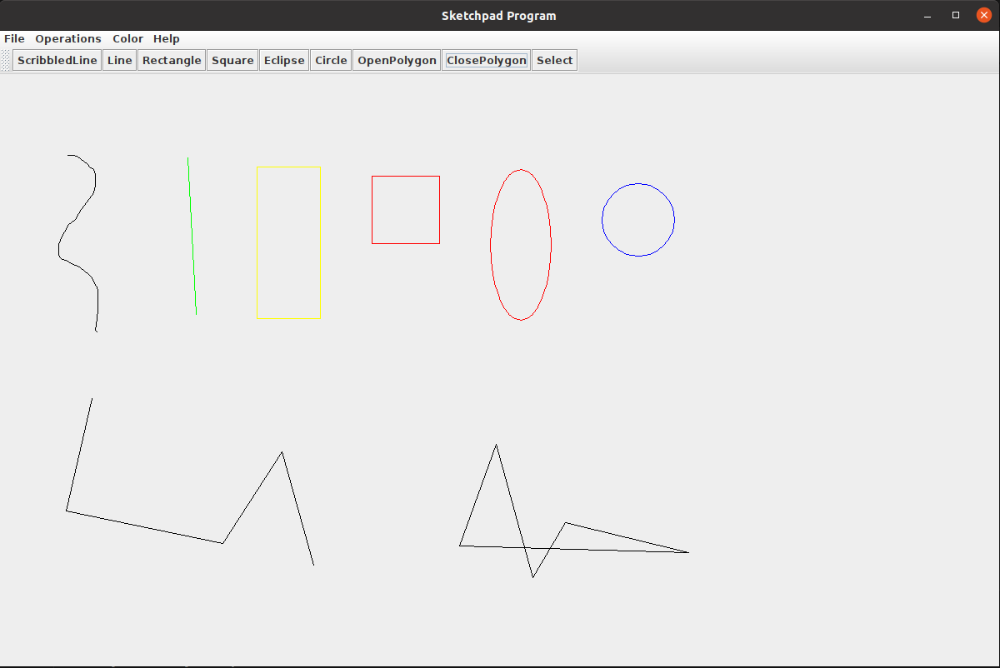

# Sketchpad_JavaAWT

## About

Sketchpad using Java AWT and Swing

## Design Artefacts

1. For design process and design artefacts, please refer to the PDF file in this project.

2. For the source file of the design artefacts, please refer to the `/doc/res` path.

## UI

Below is a screenshot of the running program

## Note:

### OpenPolygon Mode

1. Left click and hold to drag the mouse to see the line, release when at right position.
2. Once done with your polygon, right click to save.

### ClosePolygon Mode

1. Left click to add points to the polygon.
2. Once done with your polygon, right click to save.

### Group/Ungroup

1. First click the Select button to enter the **select** mode;
2. Click and select multiple objects that you want to group/ungroup;
3. Open **Operations** menu, click group/ungroup accordingly.

### File Load

1. There is a `example.sketchpad` file you can load to test;
2. Open the **File** menu, then click load and finish selection;
